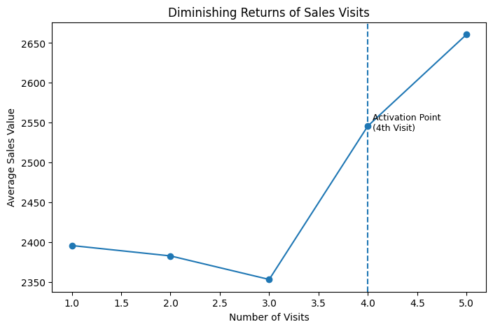

# 📊 Pharma CRM Data Warehousing & Analytics Project

## Overview
This project demonstrates an **end-to-end Data Warehousing workflow** using a simulated Pharma CRM dataset.  
The main focus is **data modeling, data quality handling, and analytics readiness**, not just SQL queries or dashboards.

The solution follows a **Bronze → Silver → Gold** architecture implemented in **PostgreSQL**.

---

## Architecture
**Source Systems → Bronze → Silver → Gold**

- **Bronze Layer**
  - Raw data ingestion
  - No business logic
  - Data loaded as-is

- **Silver Layer**
  - Data cleaning and standardization
  - Type casting (dates, numerics, text)
  - Handling inconsistent formats

- **Gold Layer**
  - Analytics-ready tables
  - Fact and Dimension modeling
  - Business-driven assumptions
  - Ready for BI, advanced analytics, and ML use cases

---

## Key Design Decisions
- Rebuilt broken identifiers (e.g. sales rep IDs) using **window functions**
- Applied **surrogate keys** where source IDs were unreliable
- Explicitly documented assumptions instead of hiding data issues

> In real-world projects, these decisions would be validated with technical teams or stakeholders.

---

## ⚠️ Data Disclaimer
🚨 **All data in this project is synthetic and generated using ChatGPT.**

Reasons:
- Avoid using real or sensitive pharmaceutical data
- Safely demonstrate data engineering and analytics skills

As a result, the data contains intentional inconsistencies, such as:
- Invalid or mixed date formats
- Financial mismatches (e.g. `total_value ≠ quantity × unit_price`)
- Logically inconsistent identifiers

Some issues were fixed, others were intentionally left to reflect **real-world data ambiguity**.

---

## Analytics Readiness
After building the Gold layer, the model supports many analytical use cases, including:
- Funnel analysis
- Cohort analysis
- Rep performance analysis
- Product adoption analysis
- Promotional ROI
- Inventory and demand analysis
- Time-based and lagged impact analysis

(30+ possible analytical directions)

---

## Implemented Advanced Analysis
### Sales Visit Effectiveness Threshold Analysis

**Business Question:**  
Is there a point at which additional sales visits change the level of business impact rather than increasing it linearly?

**Approach:**
- Visits were ordered chronologically per doctor
- Each visit was assigned a sequence number (1st visit, 2nd visit, etc.)
- Average sales generated after each visit were calculated and aggregated

**Key Insight:**
- The first **three visits** show **stable and comparable sales impact**
- Starting from the **fourth visit**, a clear **threshold effect** appears
- After crossing this threshold, average sales shift to a **higher performance level**

**Business Interpretation:**
- Sales effectiveness does **not grow linearly** with each visit
- Early visits (1–3) likely focus on awareness and relationship building
- The **fourth visit acts as a trigger point**, where accumulated exposure
  translates into stronger commercial response
- Visit strategies should aim to **reach critical effectiveness thresholds**
  rather than distributing visits uniformly

### Visualization: Sales Visit Effectiveness Threshold

---

## Tech Stack
- PostgreSQL
- SQL (CTEs, Window Functions)
- Data Warehousing Concepts
- Analytics Engineering Principles
